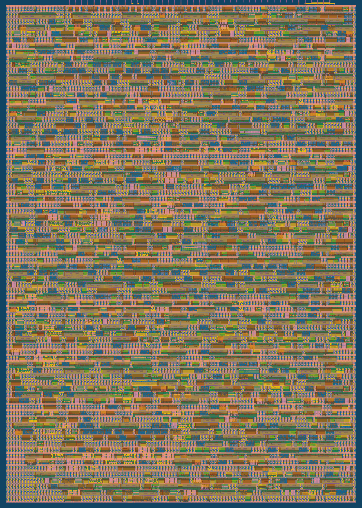
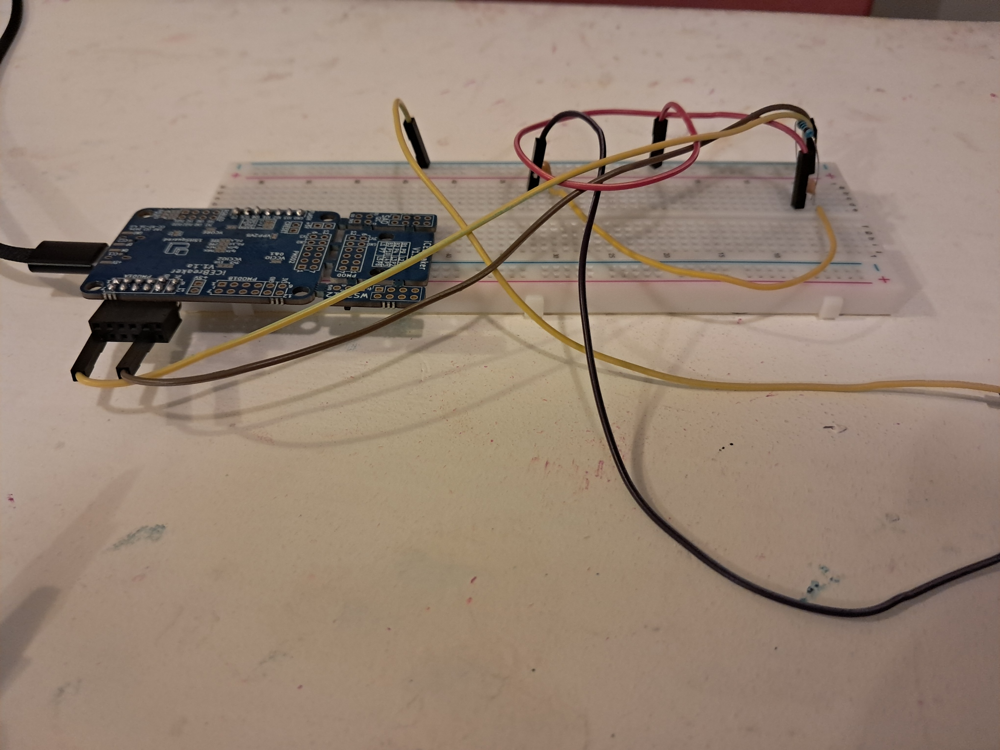

## Poly Synth v1.0

Poly Synth represents my first exploration of RTL and digital design and verification. It is a 3-voice polyphonic synthesizer built for TinyTapeout Sky26c. It has 3 waveforms: square, sawtooth, and triangle. You can customize the duty cycle of the square wave. The chip is controlled via an SPI input, and is outputted via a 1-bit sigma-delta.

I decided to build this because of a cool experience I had while learning about basic circuits. I discovered that speakers work literally by transposing an electric wave as a sound wave. I hooked alligator clips to a 3.5mm jack and recorded the output of my Analog Discovery 2 waveform generator at different frequencies. I thought it was the coolest thing ever. Ever since then, I've wanted to try building my own synthesizer. Here it is!

(This is the FPGA model haha)

I built this from scratch, including golden model test benches, which I mutation tested. I also ran gate-level simulations, and finally I ran it on an iCEBreaker FPGA. I was able to drive it to my headphones without amplification! I got it to play a small loop (it's supposed to be the 25m theme from Donkey Kong)

[Hear the audio clip](docs/dk_v13.wav)

(Supposed to be. It's still a WIP lol.)

## Repository layout

| Path | Contents |
| --- | --- |
| [`docs/info.md`](docs/info.md) | Datasheet: register map, SPI frame format, timing limits, and the external filter you need to hear anything. |
| `src/` | The RTL. |
| `test/` | Cocotb testbench, run against both the RTL and the post-layout gate-level netlist. |
| `info.yaml` | TinyTapeout project config: pinout, tile count, clock. |

### Source files

| Module | Role |
| --- | --- |
| `tt_um_colbywonn_poly_synth.v` | TinyTapeout wrapper. Maps SPI onto `ui_in[2:0]` and the audio bitstream onto `uo_out[0]`. |
| `synth_core.v` | Top level of the portable core. Wires everything together. |
| `spi_peripheral.v` | 35-bit SPI receiver, clock domain crossing, and the six control registers. |
| `dds.v` | One voice: phase accumulator plus shaper. |
| `phase_acc.v` | 32-bit phase accumulator. Sets pitch. |
| `shaper.v` | Turns phase into a sawtooth, square (with selectable duty), or triangle. |
| `mixer.v` | Sums the three voices. |
| `sigma_delta.v` | First-order modulator. Turns the 16-bit mix into a 1-bit stream. |
